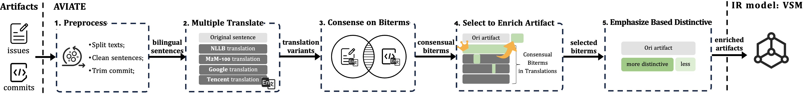

# ASE2024

In this paper, we propose a framework, named as **AVIATE** (tr**A**nslation **V**ariant b**I**lingu**A**l **T**raceability r**E**covery), where we utilize the consensual biterms from the multiple translations of the different types of artifacts (i.e. issues and commits for our applied data) to enhance the bilingual traceability recovery of IR-based approaches.

Specifically, we **first** employ four mainstream translators (i.e., [NLLB-1.3B model](http://huggingface.co/facebook/nllb-200-1.3B), [M2M-100-12B model](http://huggingface.co/facebook/m2m100-12B-last-ckpt), [Google Translate](https://cloud.google.com/translate), and [Tencent Translate](https://cloud.tencent.com/product/tmt)) to generate translation variants for sentences (with necessary pre-processing) in the artifacts that are not purely in English. We **then** employ the natural-language-processing tool [CoreNLP](https://stanfordnlp.github.io/CoreNLP/) to traverse translation variants and generate candidate biterms. By intersecting the biterms derived from the two different kinds of artifacts, we obtain the initial consensual biterms. Because these consensual biterms are extracted from a much larger corpus that is augmented by translation variants (i.e., each bilingual sentence in a given artifact will be expanded to four translate variants in this paper), we **further** proposed a TF-IDF-like metric for our filtering strategy to select distinctive consensual biterms as the final enrichment to improve the quality of bilingual artifact texts. We argue that these distinctive consensual biterms extracted from translation variants consistently capture the vital descriptions of system functionalities across the bilingual artifacts, and are thus important to improve IR-based traceability in bilingual software projects. **Accordingly**, we then proposed an enhanced weighting factor of the selected biterms to ensure that the critical information captured by distinctive consensual biterms receives adequate attention in the IR model. **Finally**, we use the VSM, a simple, effective, and robust IR model validated in traceability research, to calculate the textual similarity between the enriched and weighting-factor-enhanced artifacts and generate the candidate trace list accordingly.

The overview of our approach is as follows:




To validate the effectiveness of AVIATE, we conducted experiments on the dataset containing [17 bilingual projects proposed by Lin et al](https://zenodo.org/records/3713256). First, we evaluated the performance of VSM based on the translations from four different translators and identified an optimal single-translation-based IR approach (i.e., VSM based on Tencent Translate service). Then, we utilized AVIATE to enhance the identified best translation results with the consensual biterms extracted from multiple translation variants. Additionally, we introduced the consensus biterm-based enhancement strategy TAROT proposed by Gao et al. for comparison, which does not take multiple translations into account. Experimental results indicate that compared to TAROT, AVIATE can provide a more significant improvement to the best Tencent Translate-based VSM. **AVIATE increases the average AP (Average Precision) by 16.67 points (a 31.43% improvement), and achieves a maximum AP increase of 30.36 (101.17%) on the Canal project. For MAP (Mean Average Precision), AVIATE achieves an average improvement of 8.38 (11.22%), and the maximum MAP improvement of 19.45 (26.64%) on the Rax project. AVIATE also outperforms TAROT by 8.46 (13.81%) in AP and 3.17 (3.96%) in MAP.** Therefore, we argue that AVIATE can serve as a robust solution to address the challenges posed by multilingualism in artifact traceability. In summary, the main contributions of this work are: (i) a novel approach called AVIATE exploiting translation variants of artifacts to improve IR-based traceability recovery in bilingual software projects; (ii) an empirical evaluation of TRIAD on seventeen open-source systems; and (iii) availability of source code and data of AVIATE.


#### The baseline approaches used in our paper can be found in:

- The basic VSM
- The VSM with machine translation
- [TAROT](https://github.com/huiAlex/TAROT)

The basic VSM can be found in `ASE2024/IR/IR_Model`. We use the four Translators in `ASE2024/Translators` to translate artifacts, then run the basic VSM on the translated artifacts.


#### The dataset used in our paper :

As we described in the paper, the original dataset released by Lin et al. did not preserve the structural information of the artifacts, including certain text formatting elements such as “\n”, and the distinction between different sections of the artifacts (i.e., issue summary or issue message, commit message or commit diff). To better apply our approach, we re-crawled the corresponding artifact texts based on the issue and commit IDs provided in the dataset. The reorganized dataset can be found in `ASE2024/DataSet/Data_ASE2024.zip`


#### Project structure：

| -- Biterm_Extractor/

| ------ MultiTransBitermExtractor.py  # Extract consensus biterms from multiple translation variants

| -- DataSet/  # Data_ASE2024.zip  

| -- IR/

| ------ DataSets/  # The data structure used for processing datasets (issues, commits, links)

| ------ IR_Model/  # VSM model

| ------ Measures/

| ---------- Metrics.py  # Calculate AP and MAP

| ------ Processors/

| ---------- DataSetProcessor.py  # Read and save datasets

| ---------- Preprocessor.py  # Text preprocessing

| ------ Experiment.py  # Run the Basic VSM model and do repetition

| -- stopwords/

| -- Translators/  # NLLBTranslators, M2M100Translators, GoogleTranslators and TencentTranslators

| -- config.ini  # Configure dependency paths

| -- IOUtils.py  # Read and Write files

| -- LangUtils.py  # Identify the language used in sentences

| -- Run.py  # Configure Experiment and run our approach


#### How to run this project：

1. Configure `config.ini` files

   ```ini
   dataset_path = ;  The path of DataSet/Data_ASE2024. e.g. C:/DataSet/Data_ASE2024
   nltk_resources = ; The additional denpendency of NLTK, such as "taggers" or "tokenizers". e.g. C:/NLTK
   stanfordcorenlp_path = ; The path of Stanfordcorenlp. e.g. C:/stanford-corenlp-4.5.1
   nllb_path = ; The path of NLLB-1.3B model. e.g. C:/NLLB-1.3B
   m2m100_path = ; The path of M2M-100-12B model. e.g. C:/M2M-100-12B
   ```

2. Run `MultiTransBitermExtractor.py` to extract consensus biterms from multiple translation variants. 

3. Run `Run.py` to run the basic VSM. Modify "version_path" and "biterm_config" to change the data and approach. The default configuration is to run the Basic VSM + AVIATE. 

   ```python
   # Configure Translation Version Path
   # It can be configured as "Multi_trans", "NLLB_trans", "M2M100_trans", "Tencent_trans" or "Google_trans".
   # It can also be configured as "", which means "No Translation"
   version_path = "Multi_trans"
   
   # Configure non-English languages: "zh"(chinese), "jp"(japanese), "po"(Portuguese), "ko"(Korean)
   # If artifacts have been translated, it can be configured as "en"(english)
   foreign = "en"
   
   pre = ""
   
   # "biterm_config" can be configured as "", "biterm" or "biterm score"
   # "": Basic VSM
   # "biterm": Basic VSM + Biterm
   # "biterm score": Basic VSM + AVIATE
   for biterm_config in ["biterm score"]:
       print("\033[31m" + biterm_config + "\033[0m")
       run_experiment(repo_list=repos, version=version_path, fo_lang_code=foreign, prefix=pre)
   ```

